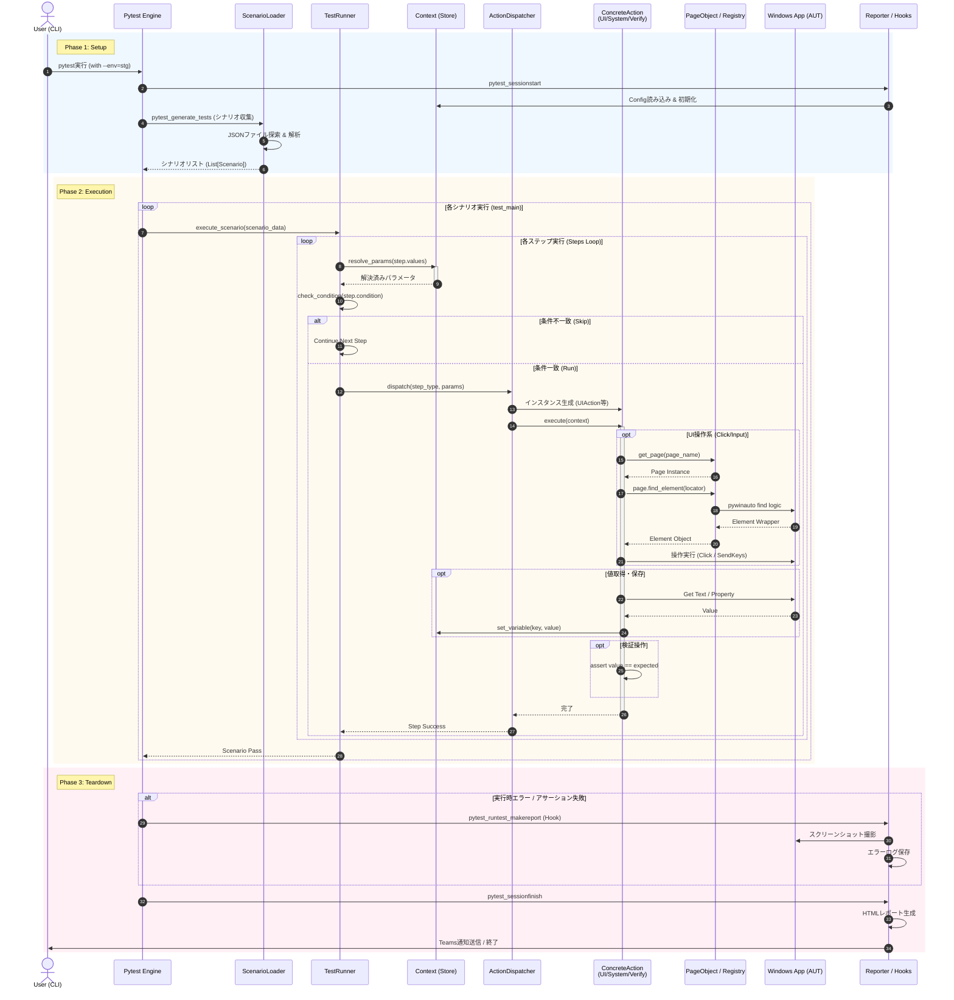

設計の解像度を上げるために、\*\*「JSONシナリオの読み込みから、画面操作、終了処理まで」\*\*の一連の流れを表す詳細シーケンス図を作成しました。

この図では、特に\*\*「変数の解決（Context）」**と**「操作の振り分け（Dispatcher/Action）」**、そして**「Page Objectの呼び出し」\*\*がどのように連携しているかに注目してください。

-----

# E2Eテスト自動化フレームワーク 詳細シーケンス図

## 1\. シーケンス図 (Sequence Diagram)

## 2\. フローの詳細解説

図中の主要な処理ブロックについて解説します。

### Phase 1: セットアップと収集 (Setup Phase)

1.  **動的テスト生成:** `pytest` の標準機能である `pytest_generate_tests` フックを利用します。ここでJSONファイルを全て読み込み、「シナリオの数だけテスト関数（`test_main`）をパラメータ化して生成」します。これにより、テスト結果には `test_main[login_scenario]`, `test_main[order_scenario]` のように個別に表示されます。
2.  **Configの一元化:** `config.ini` の内容は最初に `Context` にロードされ、以降はシングルトン的に振る舞います。

### Phase 2: 実行ループ (Execution Phase)

このフレームワークの核心部分です。

  * **変数解決 (`resolve_params`):**
      * ステップを実行する**直前**に、パラメータ内の `${...}` を解決します。
      * これにより、前のステップで画面から取得（Capture）した値を、次のステップの入力値として使うことが可能になります。
  * **Page Objectの遅延ロード:**
      * すべてのPage Objectを最初に初期化するのではなく、アクションが必要としたタイミングで `PageRegistry` から呼び出します（Lazy Loading）。
      * `UIAction` クラスは「どの画面の」「どの要素を」操作するかだけをJSONから受け取り、実際の検索ロジックは Page Object に委譲します。

### Phase 3: エラーハンドリング (Teardown Phase)

  * **フックによる自動撮影:**
      * `try-except` を各ステップに書くのではなく、pytestの `pytest_runtest_makereport` フックを利用します。テストが `Failed` ステータスになった瞬間を検知し、自動的にデスクトップ全体のスクリーンショットを取得します。
